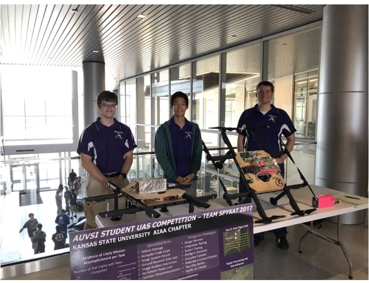

# Alex Kim's Engineering Portfolio

Hello and thank you for stopping by! My name is Alex and I am a graduate student in Mechanical Engineering at Kansas State University. When I am not teaching [Controls](https://catalog.k-state.edu/preview_course_nopop.php?catoid=16&coid=82554) lab sections or doing research for my thesis, I spend my time developing for our student organization called SUAS (Small Unmanned Aerial Systems) Design Team. Working with my teammates, I led the development of [image analysis](https://github.com/0b10010010/ImageAnalysis) system to capture and localize targets in ROI (Region of Interest) from the ground up. I also had an opportunity to lead the team as a president as well as serving as a treasurer.

During the summer of 2020 I had an exciting opportunity to join an internship program at 4D Avionic Systems. I enjoyed the challenges of my work integrating a flight controls system from theory into a testable prototype. I had an amazing experience bringing company's vision into the beginning of reality by prototyping, analyzing, and creating/modifying software to ensure the safety and performance of test flights. During my internship with the company, I learned valuable lessons working with open source platforms and I loved every moment tinkering with the prototype.

Finding something I love spending time with is important to me. Whether if it is work or hobby, I prefer to immerse myself into and being able to share that moment with passionate teams to bring something meaningful together sounds like a solid foundation towards better outcomes as a whole.

