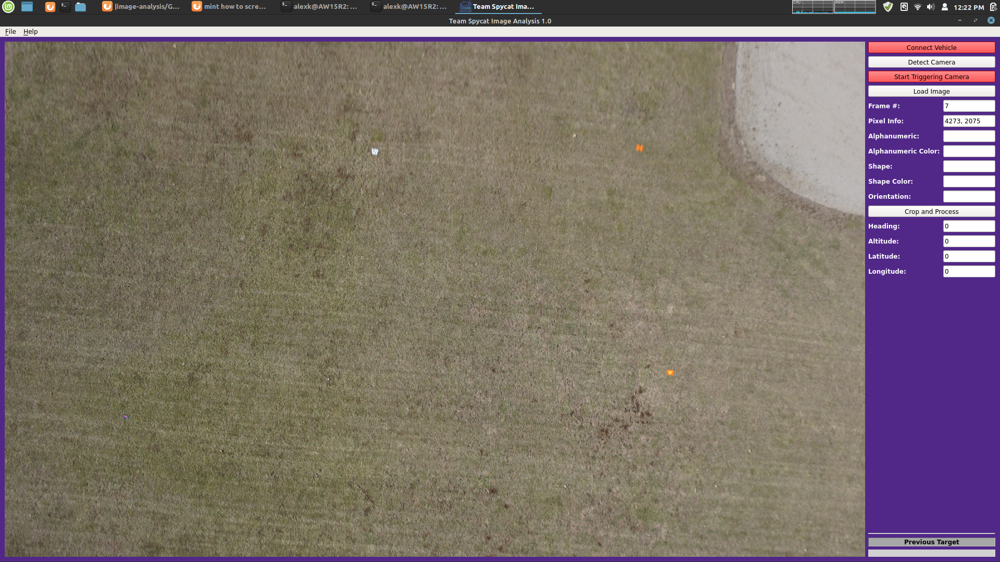

#SUAS Design Team
##[Image Analysis](https://github.com/0b10010010/ImageAnalysis)

The following screenshot shows the graphical user interface I developed. The purpose is to load, crop, classify, geolocate, and export target images taken during the flight. The process is based on HITL (Human In The Loop).


The operator can check incoming images for targets which are colored alphanumeric characters printed on some shapes. The operator then can scroll in and out to inspect the image and drag to crop the target image. Along with cropped image, its metadata is exported out for submission. The GUI will also return calculated GPS coordinates of each targets within the image.

The system is based on an OBC (Onboard Computer), a STM32L4 Nucleo board, a Sony camera, and a GPS receiver. When the voltage of hotshoe on camera goes low, or high depending on the camera, triggers an interrupt service routine on the microcontroller. The ISR sends the last known filtered GPS location as serial data over USB to the OBC. Then the OBC will convert and append serial data into a text file with new GPS coordinates. The directory that contains cropped images and their GPS coordinates is mirrored with a directory on a GCS (Ground Control Station) for submission purposes.

The following is an example output:
```text
Image index: 1 Date:2020/2/1 18:16:32:200239166 lat/lon: 39.2027969,-96.5458908
Image index: 2 Date:2020/2/1 18:16:35:400238232 lat/lon: 39.2027969,-96.5442504
Image index: 3 Date:2020/2/1 18:16:38:200237413 lat/lon: 39.2027931,-96.5458908
Image index: 4 Date:2020/2/1 18:16:41:400236475 lat/lon: 39.2027931,-96.5458908
```


